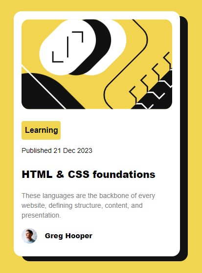

# Frontend Mentor - Blog preview card solution

This is a solution to the [Blog preview card challenge on Frontend Mentor](https://www.frontendmentor.io/challenges/blog-preview-card-ckPaj01IcS). Frontend Mentor challenges help you improve your coding skills by building realistic projects.

## Table of contents

- [Overview](#overview)
  - [The challenge](#the-challenge)
  - [Screenshot](#screenshot)
  - [Links](#links)
- [My process](#my-process)
  - [Built with](#built-with)
- [Author](#author)

## Overview

### The challenge

Although this project was built using Tailwind CSS, it is perfect for beginners to speed HTML & CSS fundamentals.

### Screenshot

### Links

- Solution URL: [Solution page](https://github.com/okutewonah/fm-blog-preview-card)
- Live Site URL: [View live](https://okutewonah.github.io/fm-blog-preview-card/)

## My process

### Built with

- Semantic HTML5 markup
- Tailwind CSS
- Flexbox

## Author

- Frontend Mentor - [@okutewonah](https://www.frontendmentor.io/profile/okutewonah)
- Github - [okutewonah](https://github.com/okutewonah)
